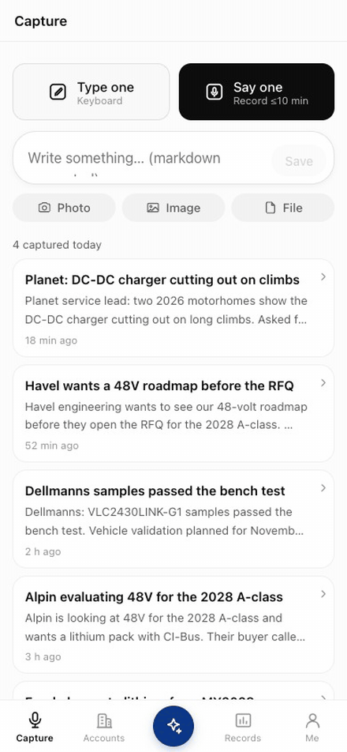
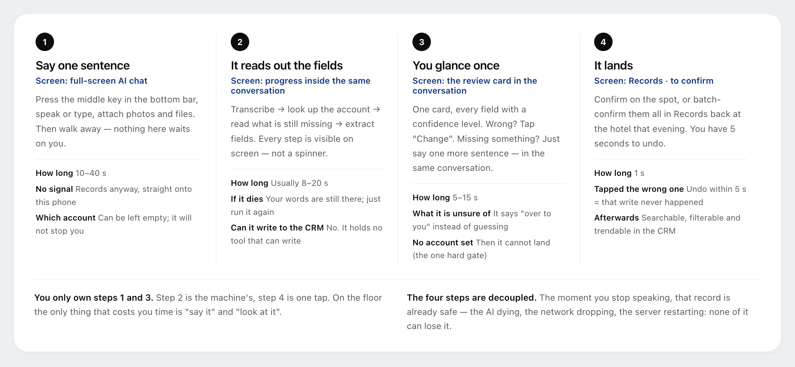
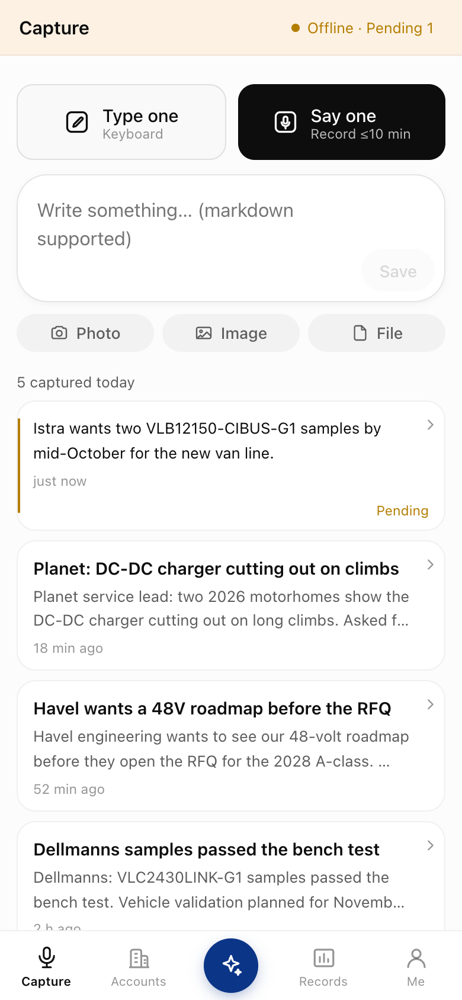
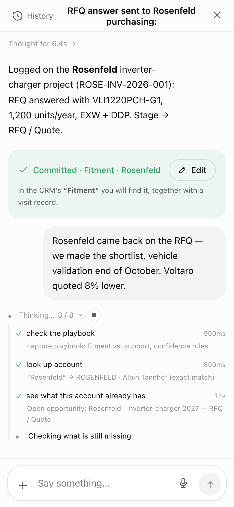
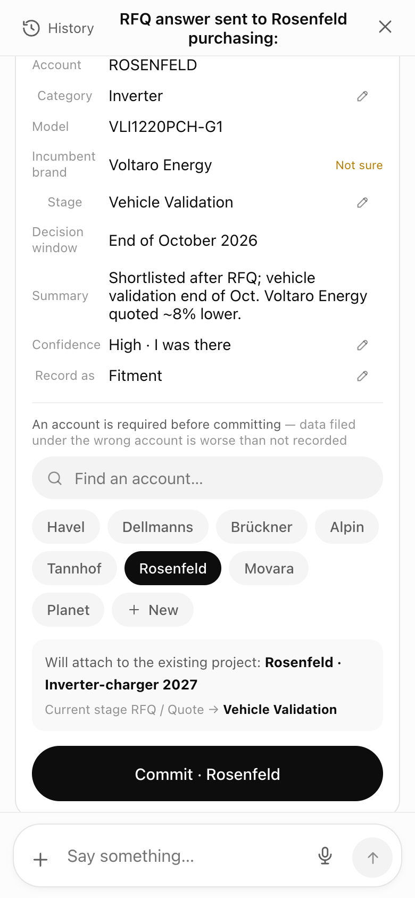
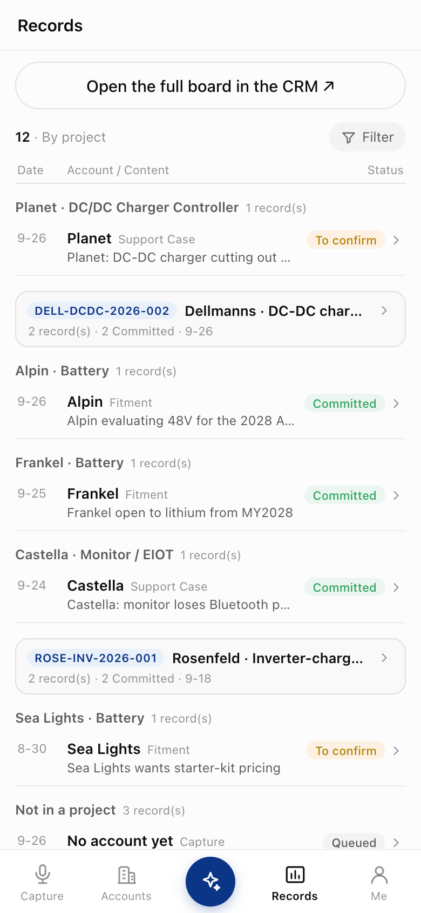
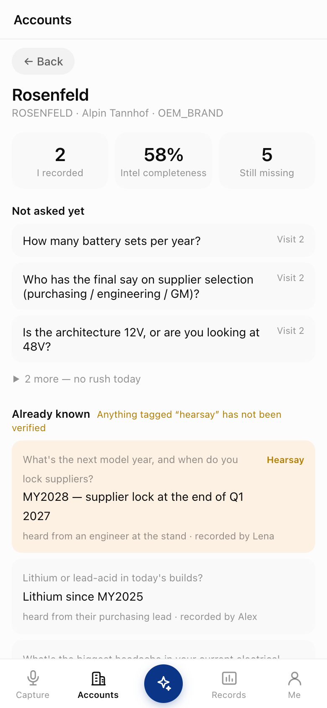
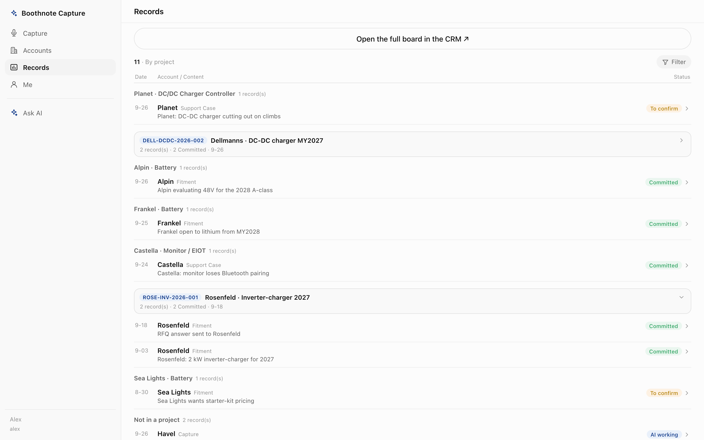
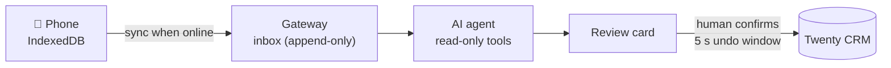

<p align="center">
  
</p>

<h1 align="center">Boothnote</h1>

<p align="center">
  <b>Say one sentence at the booth. It lands in your CRM — reviewed, structured, undoable.</b><br>
  Offline-first field capture for B2B sales teams at trade shows, with an AI agent that never writes without you.
</p>

<p align="center">
  <a href="LICENSE"></a>
  
  
  
  <a href="README.zh-CN.md"></a>
</p>

<p align="center">
  
</p>

---

A trade-show floor is the worst place to fill in a CRM form and the best place to learn things. You talk to thirty accounts a day; by evening the notes are scattered across chat apps, voice memos and a notebook, and the CRM is still empty.

**Boothnote turns one spoken or typed sentence into structured CRM records.** An AI agent reads what you said against your account list, your competitor list and the questions you still owe each account, then prepares the records. You glance at one card, fix what's wrong, and confirm. Nothing reaches the CRM before that.

It runs self-hosted on top of [Twenty](https://twenty.com), the open-source CRM, without modifying it.

## How it works

<p align="center">
  
</p>

| You said | It reads out | It becomes |
|---|---|---|
| *"Their 2027 model is switching batteries, currently on Brändle, twelve thousand a year, supplier locked before Q4."* | account · category · incumbent brand · stage · decision window | a **Visit**, a **Product fitment** row, an **Opportunity** |
| *"Rosenfeld came back on the RFQ — we made the shortlist, vehicle validation end of October. Voltaro quoted 8% lower."* | recognises the existing project → moves it one stage | the same **Opportunity**, one stage further, plus a **Visit** |
| *"Heard second-hand: Dellmanns is cutting its quota 30% next year, batteries go back out to tender."* | no field fits → **creates an intel field on the spot**, confidence kept low | an **Intel item** + **Intel value** on that account |
| *"2025-03 batch inverter cuts out under load, error E-04"* + a log PDF + a photo | product · symptom · batch · severity · next step (read from the PDF) | a **Support case** |

*All companies in this README and in the demo data are fictional.*

## Screenshots

| Capture | Agent at work | Review card | My records | Accounts & intel gaps |
|:---:|:---:|:---:|:---:|:---:|
|  |  |  |  |  |

<p align="center"></p>

## Why it's built this way

The whole design follows from one fact: **what people said during a ten-day show can't be recreated afterwards.** Everything else can be re-run.



Each stage keeps working when the next one is down: no signal in the hall → notes wait on the phone; the AI provider is down → notes wait in the gateway; the CRM is down → confirmed records wait in a queue. **Whichever stage fails, the stage before it still has the data.**

The rules that keep it that way:

1. **The raw note is append-only.** A database trigger rejects `UPDATE` and `DELETE` on `inbox`. Transcripts and extractions are derived data; they never overwrite the original.
2. **The agent cannot write to the CRM.** None of its tools can. Exactly one module writes to Twenty, and only after a human confirms.
3. **Confirmation is queued for 5 seconds.** Undo within that window means the write never happened.
4. **Relations are UUIDs or nothing.** The agent may *suggest* a new account; it never creates one by name. Linking records by name is how the spreadsheet this replaced fell apart.
5. **The PWA never talks to the CRM.** The only CRM API key lives in the gateway, and every scope check runs server-side.
6. **Attribution is optional at capture, mandatory at commit.** Every extra dropdown on the floor costs a note, but a record filed under the wrong account is worse than none.
7. **Twenty is never modified.** Everything goes through its metadata and REST/GraphQL APIs, and the schema, views and sidebar are provisioned by idempotent scripts.

## Features

**Capture (PWA)**
- Works offline: notes, audio and attachments are stored in IndexedDB and synced in the foreground (iOS has no Background Sync).
- Voice notes up to 10 minutes. If a phone call or screen lock interrupts the recording, the part already recorded is kept.
- Photos, images and files go to the model natively, with a text-extraction fallback.
- English and Chinese UI, chosen per account.
- Phone layout with a bottom bar; two columns on desktop.

**Agent**
- Runs on [Pi](https://github.com/earendil-works/pi) with 15 tools in three rings: read-only, propose-only, and a third ring that simply doesn't exist. There is no tool that creates an account or writes to the CRM, and a snapshot test fails the build if one is added.
- Playbooks are `SKILL.md` files, so you can change the agent's approach without a redeploy.
- Sessions resume: you can add one more sentence to the same conversation later.
- It can create a new intel field on the spot, under four guardrails: dedupe first, at most one per note, weight 0 so no account's completeness score drops, and tagged with the note it came from.

**CRM side**
- An intel checklist organised by *waves* (what you can ask on a first visit versus later), *weights* and *stage gates*. It drives a completeness score per account and the "3 questions to ask next".
- A records board. Records already in the CRM can be corrected in place, and soft deletes can be undone.
- Declarative provisioning of objects, fields, views and sidebar, with a schema-drift guard in CI.

**Channels**
- A DingTalk group bot: @ it with a sentence. A router decides whether the message is a note to capture or a question to answer.
- A second, read-only "lab" bot answers product questions from a document library. A grounding check flags spec numbers it cannot find in the source documents.

## Quickstart (local)

Requirements: Docker, Node ≥ 24, an OpenAI API key.

```bash
git clone https://github.com/michaelawea/boothnote.git && cd boothnote
cp .env.example .env                 # fill in the secrets it asks for (openssl rand …)

docker compose up -d                 # Postgres, Redis, Twenty (first boot takes a few minutes)
# open http://localhost:3000, create a workspace, Settings → API & Webhooks → create a key,
# put it in .env as TWENTY_API_KEY

(cd services/gateway && npm install && npm run migrate)
node scripts/provision-twenty.mjs            # custom objects & fields (idempotent)
node scripts/import-accounts.mjs             # demo accounts from data/accounts.json
node scripts/seed-suppliers.mjs --yes        # demo competitor list
node scripts/seed-intel-items.mjs --yes      # demo intel checklist
node scripts/provision-views.mjs --yes       # CRM views

(cd services/gateway && npm run adduser -- alex "Alex" admin)   # prints a one-time password

(cd services/gateway && npm run dev)         # gateway on :4000
(cd apps/capture-pwa && npm install && npm run dev)   # PWA on :5173
```

Open http://localhost:5173 and log in as `alex`. On a phone, open it over your LAN and add it to the home screen.

For a production setup (VPS + Cloudflare + Caddy, backups, one-command deploys), see [`docs/deploy.md`](docs/deploy.md).

**Make it yours:** the RV-industry example lives entirely in data and config. Replace `data/*.json` (accounts, competitors, intel checklist, speech-to-text vocabulary), the playbooks in `services/gateway/agent/skills/`, and the object definitions in `scripts/twenty-schema.mjs`.

## Repository layout

```
apps/capture-pwa/        the phone app (React + Vite + Dexie)
services/gateway/        the only write gate between the phone and the CRM (Fastify + Postgres)
  agent/                 the AI agent: tools, SKILL.md playbooks, runtime
  migrations/            numbered SQL migrations
scripts/                 provisioning, import, test and deploy scripts (all idempotent)
infra/                   Caddy, backups, database init
data/                    demo data for the RV-OEM example vertical
docs/                    architecture, API contract, agent, testing, deploy, troubleshooting
```

## Documentation

| | |
|---|---|
| [Architecture](docs/en/architecture.md) | The three decoupled stages, a note's full journey, the data model |
| [Lessons learned](docs/en/lessons.md) | Things that went wrong while building this, and the rules they left behind |
| [Gateway API contract](docs/gateway-contract.md) · [Agent](docs/agent.md) · [Testing](docs/testing.md) · [Deploy](docs/deploy.md) · [Troubleshooting](docs/troubleshooting.md) | Detailed docs (in Chinese for now) |

Code comments are mostly in Chinese. Decision IDs such as `D48` refer to the original team's internal design log, which is not published; the reasoning is usually restated next to the code.

## Testing

```bash
./scripts/test.sh        # types + unit tests + build + guards, no services needed
./scripts/test.sh all    # plus integration tests in a disposable Postgres + gateway (needs Docker)
```

Integration tests never touch your database or your CRM: they start throwaway containers and point the CRM URL at a closed port.

## Status

Boothnote was built for a B2B sales team working a ten-day European trade show and was used there in production. The RV-OEM data model is the example vertical it shipped with. Expect rough edges outside that setup, and please open issues.

## License

[Apache-2.0](LICENSE). Not affiliated with Twenty. All companies, people and products in the demo data are fictional.
