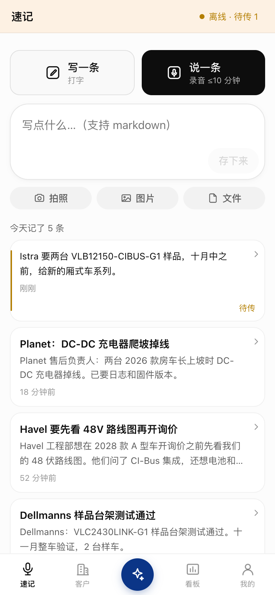
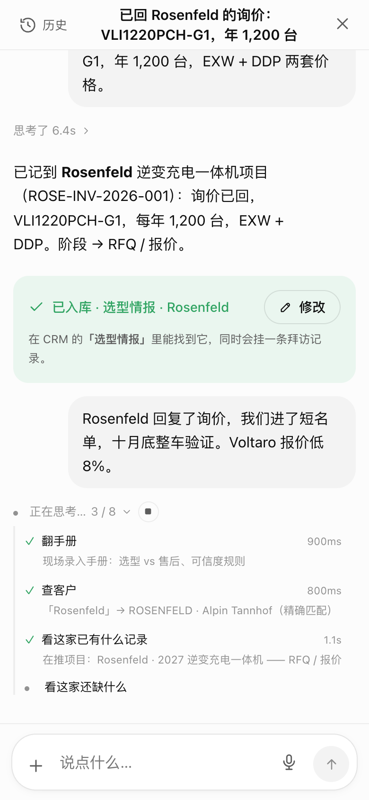
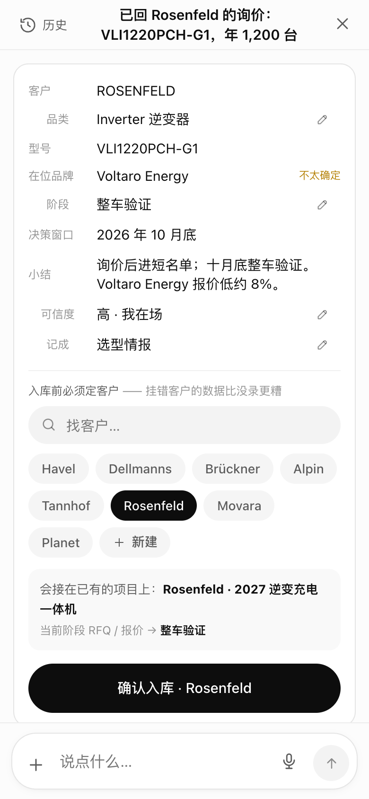
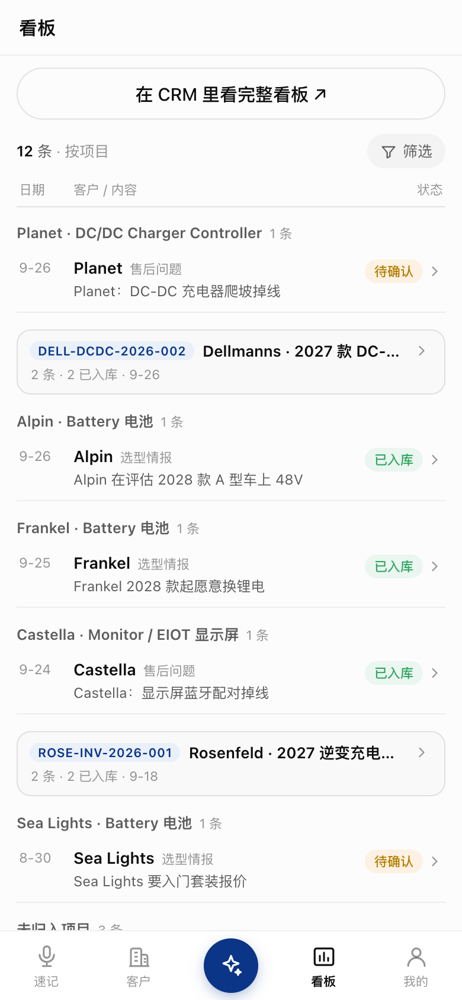
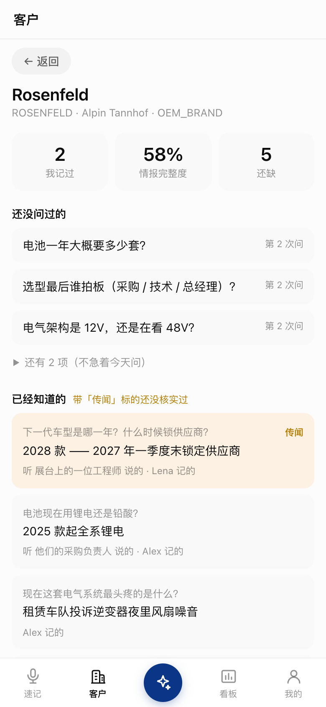
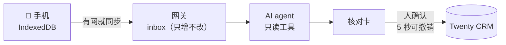

<p align="center">
  
</p>

<h1 align="center">Boothnote</h1>

<p align="center">
  <b>在展台前说一句话，它就进了 CRM —— 结构化、核对过、可撤销。</b><br>
  给 B2B 销售团队的展会现场速记系统：离线优先，AI 帮你整理，但不经你点头一个字都不写。
</p>

<p align="center">
  <a href="LICENSE"></a>
  
  
  <a href="README.md"></a>
</p>

<p align="center">
  
</p>

---

展会现场是最不适合填 CRM 表单的地方，偏偏也是信息最多的地方。一天聊三十家，到晚上笔记散在聊天软件、语音备忘录和本子里，CRM 还是空的。

**Boothnote 把一句话变成结构化的 CRM 记录。** 你说完（或打完）就可以走开；AI agent 拿你的客户名单、竞品名单和「这家还有哪些没问到」的情报清单去读那句话，把记录准备好。你看一眼核对卡，改掉不对的，点确认 —— 在那之前，CRM 里一个字都不会有。

它自托管，架在开源 CRM [Twenty](https://twenty.com) 之上，**不改 Twenty 一行源码**。

## 怎么用

<p align="center">
  
</p>

| 你说的 | 它读出来的 | 变成了什么 |
|---|---|---|
| 「他们 2027 款要换电池，现在用的 Brändle，一年一万二，Q4 前锁供应商」 | 客户 · 品类 · 在位品牌 · 阶段 · 决策窗口 | 一条**拜访**、一条**选型情报**、一个**商机** |
| 「Rosenfeld 回复了询价，我们进了短名单，十月底整车验证。Voltaro 报价低 8%。」 | 认出这是已有项目 → 阶段往前推一格 | **同一个商机**前进一格，外加一条拜访 |
| 「听说 Dellmanns 明年配额砍 30%，电池要重新招标 —— 二手消息」 | 没有现成字段 → **当场造一个情报字段**，可信度标低 | 这家客户名下的一条**情报项 + 情报值** |
| 「2025-03 那批逆变器带载掉电，报 E-04」+ 日志 PDF + 现场照片 | 产品 · 现象 · 批次 · 严重度 · 下一步（从 PDF 里读出故障码） | 一条**售后问题** |

*本文和演示数据里的公司全部是虚构的。*

## 截图

| 速记 | Agent 在干活 | 核对卡 | 我的记录 | 客户与情报缺口 |
|:---:|:---:|:---:|:---:|:---:|
|  |  |  |  |  |

<p align="center"></p>

## 为什么这么设计

所有设计都从一件事推出来：**展会十天里说过的话，事后没法重来。** 别的都能重跑。



每一段都不依赖下一段：展馆里没信号 → 速记留在手机上；模型服务挂了 → 留在网关里；CRM 挂了 → 确认过的记录在队列里等。**任何一段挂掉，前一段的数据都还在。**

守住这条性质的几条硬规则：

1. **原话只增不改。** 数据库触发器挡住 `inbox` 上的 `UPDATE` / `DELETE`。转写、抽取都是派生数据，永不回写原文。
2. **agent 写不了 CRM。** 它的工具里一个能写的都没有。整个系统只有一个模块往 Twenty 写，而且只在人确认之后。
3. **确认之后排队 5 秒。** 这 5 秒里撤销 = 从来没写过。
4. **关联只认 UUID，要么就是空。** agent 觉得是新客户，只能**提议**，绝不按名字自动建。被它取代的那份 Excel，就是因为用名字当关联键而散架的。
5. **PWA 永不直连 CRM。** 唯一的 CRM API key 在网关手里，作用域过滤全在服务端。
6. **归属：录入时可空，入库时必填。** 现场每多一个下拉就少录一条；但挂错客户比没录更糟。
7. **不改 Twenty。** 只走它的元数据与 REST/GraphQL API；对象、字段、视图、侧边栏都由幂等脚本声明式地建出来。

## 功能

**采集端（PWA）**
- 离线可用：速记、音频、附件先落 IndexedDB，前台补传（iOS 没有 Background Sync）
- 语音最长 10 分钟。接电话、锁屏打断时，已经录到的那段会保留下来
- 照片、图片、文件原生喂给模型，读不了再降级抽文字
- 中文 / 英文界面，跟账号走
- 手机底栏；电脑端双栏

**Agent**
- 基于 [Pi](https://github.com/earendil-works/pi)，15 个工具分三圈：只读 / 只提案 / 第三圈根本不存在。没有任何一个工具能建客户或写 CRM，谁往工具表里加一个，快照测试就红
- 打法写在 `SKILL.md` 里，改打法不用发版
- 对话能续：过一会儿再补一句，接在同一条对话上
- 能当场造一个新的情报字段，有四条护栏：先查重、一条速记最多造一个、权重为 0（不拉低任何客户的完整度）、带上来源速记

**CRM 侧**
- 情报清单：按「第几次见面问」、权重、阶段门组织 —— 算出每家的完整度，给出「下次该问的 3 个问题」
- 我的记录看板。已入库的记录可以就地更正，软删除可以撤销
- 对象、字段、视图、侧边栏都声明式地建出来；CI 里有 schema 漂移守卫

**渠道**
- 钉钉群机器人：群里 @ 它说一句。路由器判断这是「要记下来」还是「要一个答案」
- 第二个只读的「实验室」bot：从产品文档库回答产品问题。回答里自称出自文档的规格数字，机器会回原文逐个核对，找不到就点名

## 快速开始（本地）

需要：Docker、Node ≥ 24、一个 OpenAI API key。

```bash
git clone https://github.com/michaelawea/boothnote.git && cd boothnote
cp .env.example .env                 # 按里面的提示填（openssl rand …）

docker compose up -d                 # Postgres、Redis、Twenty（首次启动要几分钟）
# 打开 http://localhost:3000 建工作区，Settings → API & Webhooks 建一个 key，
# 填进 .env 的 TWENTY_API_KEY

(cd services/gateway && npm install && npm run migrate)
node scripts/provision-twenty.mjs            # 自定义对象与字段（幂等）
node scripts/import-accounts.mjs             # 示例客户（data/accounts.json）
node scripts/seed-suppliers.mjs --yes        # 示例竞品名单
node scripts/seed-intel-items.mjs --yes      # 示例情报清单
node scripts/provision-views.mjs --yes       # CRM 视图

(cd services/gateway && npm run adduser -- alex "Alex" admin)   # 打印一次性密码

(cd services/gateway && npm run dev)         # 网关 :4000
(cd apps/capture-pwa && npm install && npm run dev)   # PWA :5173
```

打开 http://localhost:5173，用 `alex` 登录。手机上走局域网打开，然后「添加到主屏幕」。

生产部署（VPS + Cloudflare + Caddy、备份、一条命令部署）见 [`docs/deploy.md`](docs/deploy.md)。

**换成你自己的行业**：房车行业这个例子全部在数据和配置里。换掉 `data/*.json`（客户、竞品、情报清单、转写词表）、`services/gateway/agent/skills/` 里的打法，以及 `scripts/twenty-schema.mjs` 里的对象定义。

## 文档

| | |
|---|---|
| [架构总览](docs/architecture.md) | 三段解耦、一条速记的完整旅程、模块地图、数据模型 |
| [网关接口](docs/gateway-contract.md) · [Agent](docs/agent.md) · [测试](docs/testing.md) · [部署](docs/deploy.md) · [排障](docs/troubleshooting.md) | 详细文档 |
| [Architecture (EN)](docs/en/architecture.md) · [Lessons learned (EN)](docs/en/lessons.md) | 英文版 |

代码里形如 `D48` 的决策编号，指向原团队的内部设计日志（未公开）；理由一般就写在代码旁边。

## 测试

```bash
./scripts/test.sh        # 类型 + 单元 + 构建 + 守卫，不需要任何服务
./scripts/test.sh all    # 再加集成测试：一次性 Postgres + 网关（需要 Docker）
```

集成测试**不会碰你的数据库和 CRM**：它自己起一次性容器，CRM 地址指向一个不通的端口。

## 现状

Boothnote 是为一支在欧洲展会上连续工作十天的 B2B 销售团队做的，并且在那十天里真实上线用过。房车整车厂（RV OEM）这套数据模型是它自带的示例行业。离开这个场景会有粗糙的地方，欢迎提 issue。

## 许可

[Apache-2.0](LICENSE)。与 Twenty 官方无关。演示数据中的公司、人物、产品均为虚构。
